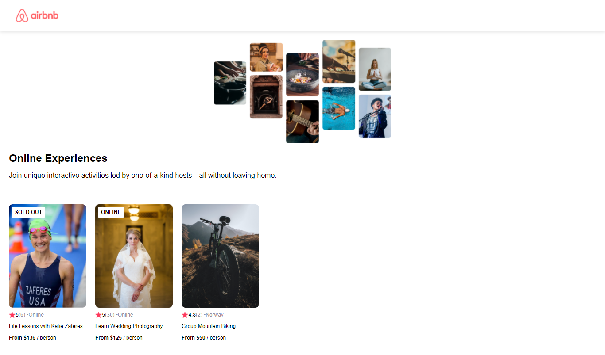

### Airbnb front page wiht React
Simples página frontal da Airbnb em React :)

## Tabela de conteúdos

- [Visão Geral](#visao-geral)
  - [O desafio](#o-desafio)
  - [Screenshot](#screenshot)
- [Meu processo](#meu-processo)
  - [Oque eu aprendi](#oque-eu-aprendi)
  - [Desenvolvimento Continuo](#development-continuo)
- [Autor](#autor)

## Visão Geral

### O desafio

Criar a primeira página do Airbnb, usando props + um arquivo para guardar os dados que estou usando.
Os dados servem como um treino de API.

### Screenshot

## Meu processo

### Oque eu aprendi

Esse foi um site mais para treinar o CSS, o React que eu usei foi básico, mas valeu a pena, depois desse projeto o nível foi aumentando muito :D

Umas das coisas que realmente me ajudou foi brincar com o `flexbox`, ajudou MUITO nos outros projetos.

### Desenvolvimento Continuo
Continuar focado no **React**, guardar as lições de `flexbox` que eu aprendi.
Bem como a minha `badge` que eu coloco no topo da imagem avisando que é online ou que sold out.

## Author

- Linkedin - [Julio Henrique](https://www.linkedin.com/in/julio-h/)
- Email - juliohjesus@gmail.com
