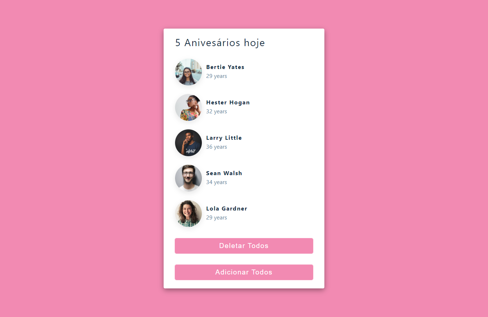

### Birthday Reminder
Um rápido projeto com React para lembrar aniversários
O link para o site se encontra abaixo.

## Tabela de conteúdos

- [Visão Geral](#visao-geral)
  - [O desafio](#o-desafio)
  - [Screenshot](#screenshot)
  - [Links](#links)
- [Meu processo](#meu-processo)
  - [Oque eu aprendi](#oque-eu-aprendi)
  - [Desenvolvimento Continuo](#development-continuo)
- [Autor](#autor)

## Visão Geral

### O desafio

Receber dados, manipular dados, criar um botão para deletar todos os usuários e criar um botão para adicionar todos os usuários.

### Screenshot

### Links

- Live Site URL: [Birthday Reminder](https://julio-henrique-birthday-reminder.netlify.app/)

## Meu processo

### Oque eu aprendi

Esse foi um dos meus primeiros sites onde eu manipulo dados com o `useState()`, os dados veio de um aquivo `data.js` mesmo, mas eu realmente aprendi muito com esse simples projeto!

### Desenvolvimento Continuo
Continuar focado no **React**, eu vou aprender os fundamentos e realmente ter uma base sólida!

## Author

- Linkedin - [Julio Henrique](https://www.linkedin.com/in/julio-h/)
- Email - juliohjesus@gmail.com
